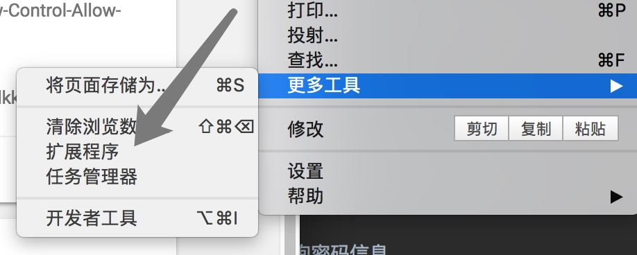
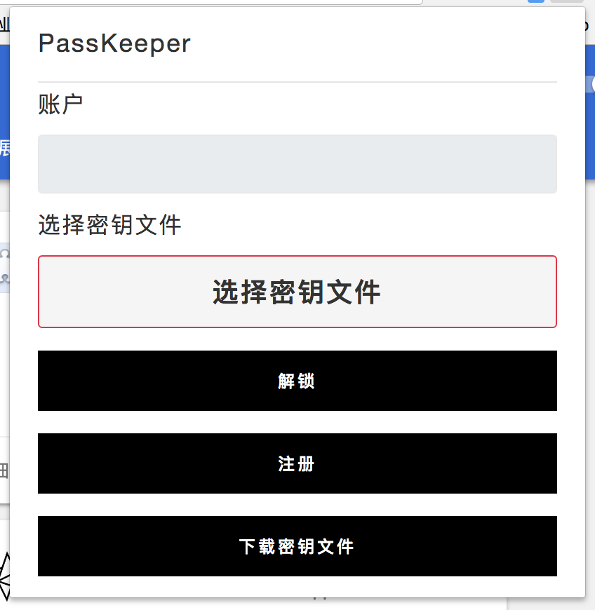
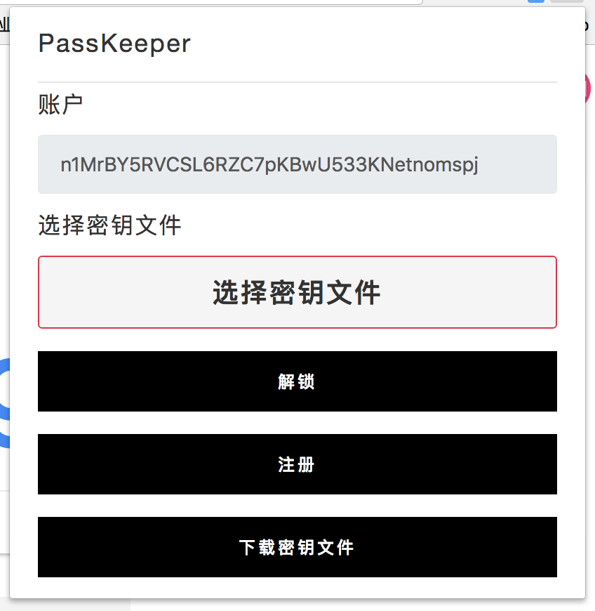
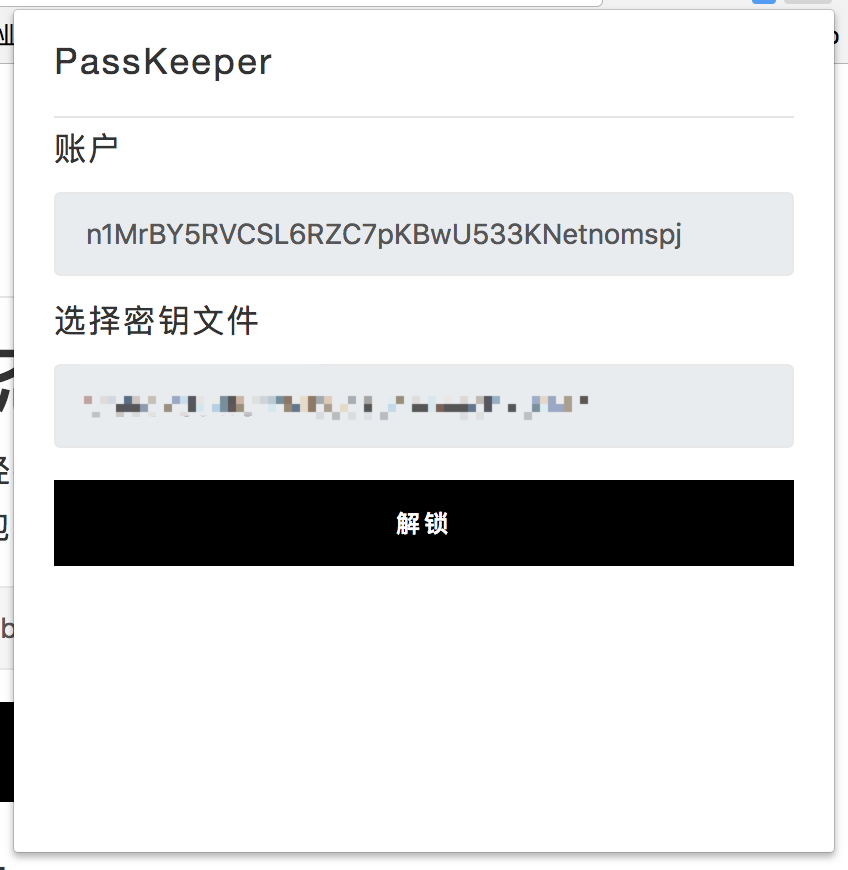
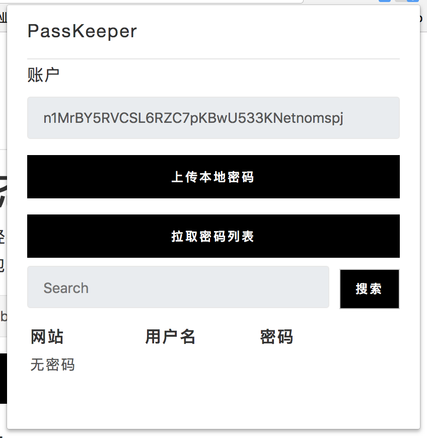
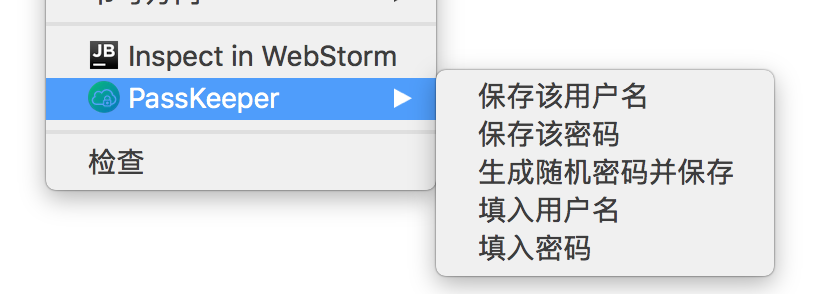
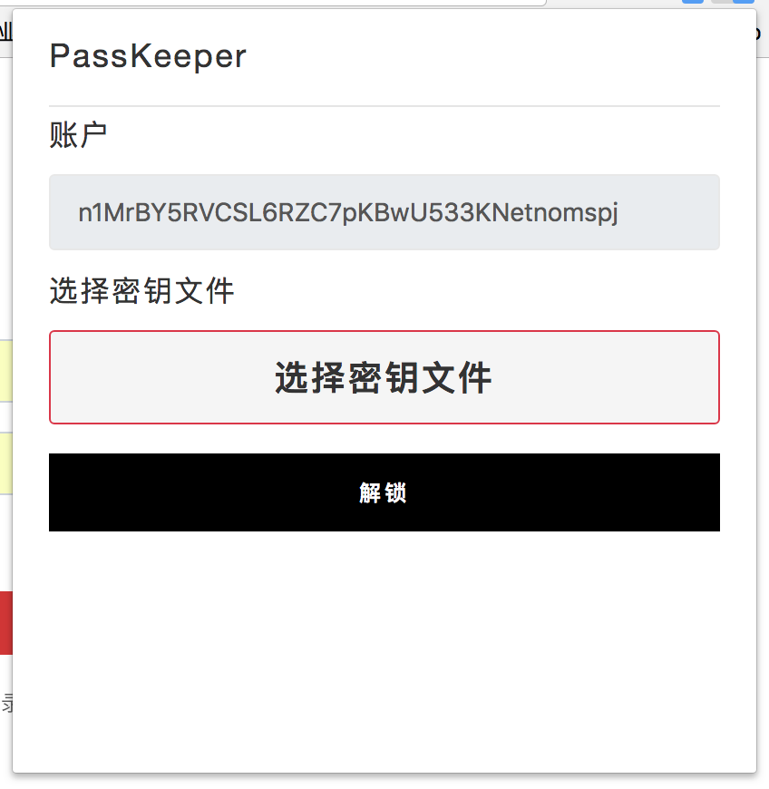

## PassKeeper

#### 基于[星云链](https://nebulas.io/)的去中心化密码管理工具。

* 简介

    结合[星云链](https://nebulas.io/)去中心化的特点与[Chrome Extension](https://chrome.google.com/webstore/category/extensions)适合PC环境的特点，通过对称加密将密码信息存储在星云链，
    而密钥文件本地生成不上传，有效保障用户密码信息的安全。
* 功能介绍

    * 加密并上传密码信息

      使用AES256对账号和密码进行加密并上传，密钥文件本地生成不上传。
    * 一键填写网页表单

        利用Chrome Extension的特性，当用户解锁后，右键点击 `填写密码` 时可实时解密密码，并填入表单。

    * 查询密码信息

        解锁后在输入框中输入搜索关键词即可查询密码信息。
* 使用说明

    1. 下载

        点击[下载链接](https://github.com/YangLuYang/PassKeeper/archive/master.zip)并解压。
    2. 安装

        如图进入Chrome浏览器的拓展程序页面。
        切换右上角的`开发者模式`为打开状态，点击`加载已解压的拓展程序`，选中刚刚解压的文件夹。浏览器右上角出现即说明安装成功。
    3. 注册

        *默认用户已安装 `NasExtWallet Extension` 并 拥有钱包地址。*
        直接点击图标打开如图
        此时因为没有页面加载content.js，所以无法使用。需要用户随便打开一个网页，并加载完成后，如下图所示，显示钱包地址才可正常使用。
        
        点击`下载密钥文件`按钮，即可下载您的密钥文件，此密钥文件用以注册、解锁、加密、解密，**丢失，不可找回！**
        下载完成后，点击`选择密钥文件`按钮，在弹出的窗口中选择刚刚下载的`key.k`，点击`注册`按钮，在弹出的NAS支付窗口中完成支付，即可完成注册.
    4. 解锁

        注册完成后，重新打开应用窗口，点击`选择密钥文件`并选择刚刚注册使用的`key.k`，如图，32位值为密钥文件的md5值。
        点击`解锁`按钮，即可完成解锁。如图
        **每次解锁的时间为5分钟。**
    5. 保存并上传密码

        打开任一网站的注册或登陆页面，在`用户名`输出框中填写用户名并右键，在展开的菜单中点击`保存用户名`，如图
        在`密码`处填写完成您的密码，点击`保存密码`或直接点击`生成随机密码并保存`，即可保存密码，此时可看到图标变化
        此处的`1`即表明有一个本地密码等待上传。
        重新点击应用图标，如果发现页面为即说明解锁时间已到，需要重新解锁。
        解锁后，点击`上传本地密码`，在打开的NAS支付窗口完成支付，即可完成上传密码。**上传过程中通过您的密钥进行加密，请不要泄漏您的密钥文件！**
    6.  填写表单与搜索密码

        解锁应用，打开上传过账户与密码的网站，在输入框上右键，分别选择`填入用户名`与`填入密码`，即可完成自动填充。

        打开应用，在搜索框中键入搜索的关键字，点击`搜索`按钮即可完成搜索。鼠标悬停即可查看被省略的部分。

* TODO LIST

    ~~国际化~~
    自动填充
    本地密码导入
    一网站多密码
    自动解锁
    移植智能设备

